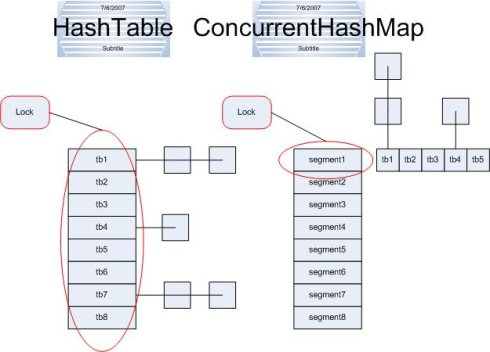

# cmap 
[](https://travis-ci.com/min1324/cmap) [](https://codecov.io/gh/min1324/cmap) [](https://goreportcard.com/report/github.com/min1324/cmap) [](https://godoc.org/github.com/min1324/cmap)

ConcurrentMap (cmap) 是 **go** 分片加锁 map 的一种。它在通过减小锁的粒度和持有的时间来提高并发性。

## 原理

ConcurrentMap 和 MutexMap 主要区别就是围绕着锁的粒度以及如何锁。如图



左边便是MutexMap的实现方式---锁整个hash表；而右边则是ConcurrentMap的实现方式---锁桶（或段）。ConcurrentMap将hash表分为8个桶（默认值），诸如load,store,delete等常用操作只锁当前需要用到的桶。

 ConcurrentMap中主要实体类就是三个：ConcurrentMap（整个Hash表）,Node（节点），Bucket（桶），对应上面的图可以看出之间的关系。

## grow 和 shrink

### 扩容gorw

增加key后，hash表总key数量count满足条件：count > 1<<2*B，或在buckut储存的key数量size满足条件：size > 1<<(B+1)，就会对hash表进行扩容。

### 收缩shrink

删除key后，hash表总key数量count满足条件：count > initSize && count < 1<<(B-1)，hash表进行收缩。

**扩容收缩操作：**

1. 将 resize 置为1。
2. newLen = 1<<B，申请新 node 。
3. 将旧node疏散到新node。
4. 完成疏散后，将旧node置空，resize置0。


## compare
The `map` type in Go doesn't support concurrent reads and writes. 

`cmap(concurrent-map)` provides a high-performance solution to this by sharding the map with minimal time spent waiting for locks.

The `sync.Map` has a few key differences from this map. The stdlib `sync.Map` is designed for append-only scenarios.

 So if you want to use the map for something more like in-memory db, you might benefit from using our version. You can read more about it in the golang repo, for example [here](https://github.com/golang/go/issues/21035) and [here](https://stackoverflow.com/questions/11063473/map-with-concurrent-access)

_Here we fork some README document from [concurrent-map](https://github.com/orcaman/concurrent-map)_

## usage

Import the package:

```go
import (
	"github.com/min1324/cmap"
)

```

```bash
go get "github.com/min1324/cmap"
```

The package is now imported under the "cmap" namespace.

## example

```go

	// Create a new map.
	var m cmap.Cmap

	// Stores item within map, sets "bar" under key "foo"
	m.Store("foo", "bar")

	// Retrieve item from map.
	if tmp, ok := m.Load("foo"); ok {
		bar := tmp.(string)
	}

	// Deletes item under key "foo"
	m.Delete("foo")

```

## bench


| name                                            | count     |    time     |     ps     |    allocs    |
| :---------------------------------------------- | :-------- | :---------: | :--------: | :----------: |
| 读取大多数命中                                  |           |             |            |              |
| LoadMostlyHits/*cmap_test.DeepCopyMap-4         | 31570358  | 35.60 ns/op |   6 B/op   | 0 allocs/op  |
| LoadMostlyHits/*cmap_test.RWMutexMap-4          | 19840526  | 58.49 ns/op |   5 B/op   | 0 allocs/op  |
| LoadMostlyHits/*sync.Map-4                      | 33907821  | 35.90 ns/op |   6 B/op   | 0 allocs/op  |
| LoadMostlyHits/*cmap.Map-4                      | 20905459  | 57.21 ns/op |   6 B/op   | 0 allocs/op  |
| 读取大多数不命中                                |           |             |            |              |
| LoadMostlyMisses/*cmap_test.DeepCopyMap-4       | 45099246  | 26.39 ns/op |   6 B/op   | 0 allocs/op  |
| LoadMostlyMisses/*cmap_test.RWMutexMap-4        | 22111984  | 54.36 ns/op |   6 B/op   | 0 allocs/op  |
| LoadMostlyMisses/*sync.Map-4                    | 51615075  | 23.64 ns/op |   6 B/op   | 0 allocs/op  |
| LoadMostlyMisses/*cmap.Map-4                    | 26444559  | 45.25 ns/op |   6 B/op   | 0 allocs/op  |
| 读写平衡                                        |           |             |            |              |
| LoadOrStoreBalanced/*cmap_test.RWMutexMap-4     | 2086924   | 557.8 ns/op |  89 B/op   | 1 allocs/op  |
| LoadOrStoreBalanced/*sync.Map-4                 | 2409666   | 616.8 ns/op |  75 B/op   | 2 allocs/op  |
| LoadOrStoreBalanced/*cmap.Map-4                 | 3032516   | 415.5 ns/op |  143 B/op  | 1 allocs/op  |
| 读写独立                                        |           |             |            |              |
| LoadOrStoreUnique/*cmap_test.RWMutexMap-4       | 1000000   | 1011 ns/op  |  178 B/op  | 2 allocs/op  |
| LoadOrStoreUnique/*sync.Map-4                   | 1000000   | 1280 ns/op  |  163 B/op  | 4 allocs/op  |
| LoadOrStoreUnique/*cmap.Map-4                   | 2135676   | 730.6 ns/op |  282 B/op  | 2 allocs/op  |
| 读写冲突                                        |           |             |            |              |
| LoadOrStoreCollision/*cmap_test.DeepCopyMap-4   | 56008429  | 20.92 ns/op |   0 B/op   | 0 allocs/op  |
| LoadOrStoreCollision/*cmap_test.RWMutexMap-4    | 7257867   | 163.1 ns/op |   0 B/op   | 0 allocs/op  |
| LoadOrStoreCollision/*sync.Map-4                | 44704843  | 26.09 ns/op |   0 B/op   | 0 allocs/op  |
| LoadOrStoreCollision/*cmap.Map-4                | 5274472   | 232.9 ns/op |   0 B/op   | 0 allocs/op  |
| 读删平衡                                        |           |             |            |              |
| LoadAndDeleteBalanced/*cmap_test.RWMutexMap-4   | 6776074   | 176.8 ns/op |   3 B/op   | 0 allocs/op  |
| LoadAndDeleteBalanced/*sync.Map-4               | 42597236  | 28.90 ns/op |   4 B/op   | 0 allocs/op  |
| LoadAndDeleteBalanced/*cmap.Map-4               | 17372445  | 66.46 ns/op |   4 B/op   | 0 allocs/op  |
| 读删独立                                        |           |             |            |              |
| LoadAndDeleteUnique/*cmap_test.RWMutexMap-4     | 6245928   | 192.7 ns/op |   7 B/op   | 0 allocs/op  |
| LoadAndDeleteUnique/*sync.Map-4                 | 54371384  | 22.42 ns/op |   8 B/op   | 0 allocs/op  |
| LoadAndDeleteUnique/*cmap.Map-4                 | 17595276  | 69.03 ns/op |   8 B/op   | 0 allocs/op  |
| 读删冲突                                        |           |             |            |              |
| LoadAndDeleteCollision/*cmap_test.DeepCopyMap-4 | 5193744   | 240.9 ns/op |  48 B/op   | 1 allocs/op  |
| LoadAndDeleteCollision/*cmap_test.RWMutexMap-4  | 8262384   | 147.3 ns/op |   0 B/op   | 0 allocs/op  |
| LoadAndDeleteCollision/*sync.Map-4              | 100000000 | 11.72 ns/op |   0 B/op   | 0 allocs/op  |
| LoadAndDeleteCollision/*cmap.Map-4              | 6053292   | 203.6 ns/op |   0 B/op   | 0 allocs/op  |
| 删除冲突                                        |           |             |            |              |
| DeleteCollision/*cmap_test.DeepCopyMap-4        | 5107717   | 212.8 ns/op |  48 B/op   | 1 allocs/op  |
| DeleteCollision/*cmap_test.RWMutexMap-4         | 8154603   | 144.8 ns/op |   0 B/op   | 0 allocs/op  |
| DeleteCollision/*sync.Map-4                     | 92244220  | 12.90 ns/op |   0 B/op   | 0 allocs/op  |
| DeleteCollision/*cmap.Map-4                     | 5844783   | 205.7 ns/op |   0 B/op   | 0 allocs/op  |
| 遍历                                            |           |             |            |              |
| Range/*cmap_test.DeepCopyMap-4                  | 121210    | 10327 ns/op |   0 B/op   | 0 allocs/op  |
| Range/*cmap_test.RWMutexMap-4                   | 19650     | 62535 ns/op | 16384 B/op | 1 allocs/op  |
| Range/*sync.Map-4                               | 111723    | 10640 ns/op |   0 B/op   | 0 allocs/op  |
| Range/*cmap.Map-4                               | 47502     | 25803 ns/op | 33410 B/op | 64 allocs/op |
|                                                 |           |             |            |              |
| AdversarialAlloc/*cmap_test.DeepCopyMap-4       | 1648602   | 1626 ns/op  |  276 B/op  | 1 allocs/op  |
| AdversarialAlloc/*cmap_test.RWMutexMap-4        | 15540801  | 74.92 ns/op |   8 B/op   | 1 allocs/op  |
| AdversarialAlloc/*sync.Map-4                    | 3247868   | 387.6 ns/op |  49 B/op   | 1 allocs/op  |
| AdversarialAlloc/*cmap.Map-4                    | 19950106  | 60.10 ns/op |   8 B/op   | 1 allocs/op  |
|                                                 |           |             |            |              |
| AdversarialDelete/*cmap_test.DeepCopyMap-4      | 2879204   | 437.9 ns/op |  168 B/op  | 1 allocs/op  |
| AdversarialDelete/*cmap_test.RWMutexMap-4       | 10290254  | 107.8 ns/op |  25 B/op   | 1 allocs/op  |
| AdversarialDelete/*sync.Map-4                   | 5462886   | 218.0 ns/op |  34 B/op   | 1 allocs/op  |
| AdversarialDelete/*cmap.Map-4                   | 23674045  | 49.53 ns/op |   8 B/op   | 1 allocs/op  |

